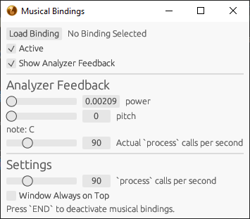

# Musical Bindings

Binds musical notes from the microphone to key presses.

Musical Bindings can help you build whistling muscles, tune whistling pitch, learn the recorder, or understand how it feels for a video game character to walk so far.

### Supported Platforms
* Windows (because [active_window.rs](./src/active_window.rs) and [key_end.rs](./src/key_end.rs) use [windows](https://crates.io/crates/windows))

## Quick Setup
1. [Download the latest release](/releases/latest/download/musical_bindings.zip) from the releases page.
2. Extract and run the downloaded `musical_bindings` application.
3. Press the `Load Binding` button and select binding script (example scripts in the repository [binding directory](./binding/)).

## Musical Binding Scripts
Musical bindings can be scripted with the Lua programming language.
### Scripting Example
Have a look at the [binding directory](./binding/) for more examples.
```lua
-- Writes the currently detected musical note from the microphone to a Windows 10 Notepad

-- `keyboard` mode because this script doesn't use emojis or special characters
input_mode = 'keyboard'

-- Only accepts windows that end with " - Notepad" in the title
function accepts(window)
    return window:find(' - Notepad$') ~= nil
end

local pressing_note = nil

function process()
    -- Makes sure the user is loud enough before pressing keys
    if power > 0.025 then
        if note ~= pressing_note then
            if pressing_note then
                keys_up(pressing_note) -- Un-presses previous note
            end
            keys_down(note) -- Presses current note
            pressing_note = note
        end
    else
        if pressing_note then
            keys_up(pressing_note) --Un-presses note because user is too quiet
        end
        pressing_note = nil
    end
end

```
### Scripting Cheat Sheet
```lua
-- Global Overrides
input_mode: string              -- Input mode to use: 'keyboard' (default) or 'character'
accepts(window: string) -> bool -- Returns true if the script accepts the window title
process()                       -- Processes the global API into keyboard inputs

-- Global API
note: string            -- Current note: A, A#, B, C, C#, D, D#, E, F, F#, G, or G#
note_frequency: number  -- Current note frequency
frequency: number       -- Current frequency
octave: number          -- Current octave
cents_offset: number    -- How untuned the current note is from -50 to 50 cents
in_tune: bool           -- True if the note is tuned (within a 10 cent offset)
pitch: number           -- Current pitch
power: number           -- Current microphone power between 0 to 1
keys_down(keys: string) -- Presses every keyboard key in the string
keys_up(keys: string)   -- Releases every keyboard key in the string
```
Avoid using `"character"` as the `input_mode` for software that requires quick feedback because each key press pauses the thread then immediately releases the key. Look at Enigo issues [#45](https://github.com/enigo-rs/enigo/issues/45) and [#186](https://github.com/enigo-rs/enigo/issues/186) for more information.

## Planned Features
* More Scripting Examples
* Special Keys (Shift, Ctrl, Alt, etc.)
* Cursor Clicking and Positioning
* Gamepads
* Multi-Platform (linux)
* Multiple Microphones Selection
* Multiple Active Scripts
* Preset Scripts (shipped with application)

## How does it work?
The microphone input is gathered by the `cpal` and `ringbuf` crates. The audio samples are processed into note information by the `pitch-detector` crate. The operating system inputs are simulated by the `enigo` and `windows` crates. The Lua scripting is handled by the `mlua` crate. And the graphical interface is created with the `eframe` and `rfd` crates.

The audio samples processings and script executions are on a seperate thread from the graphical interface to prevent fixing simulated inputs to a limited frame-rate.

### License
Note icon by Nacky Slocker.

Licensed under the [MIT license](./LICENSE).
